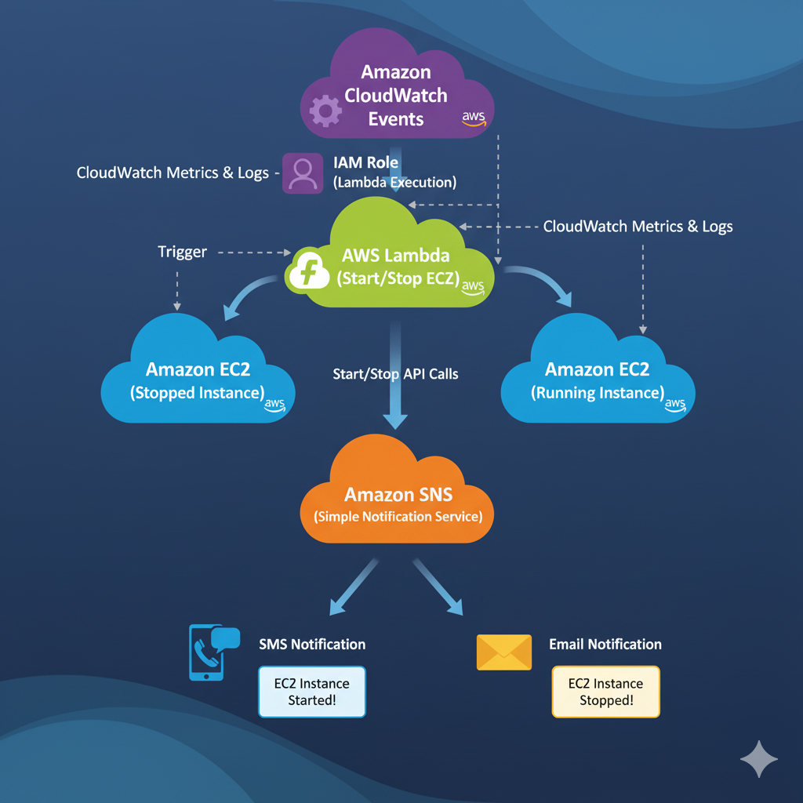
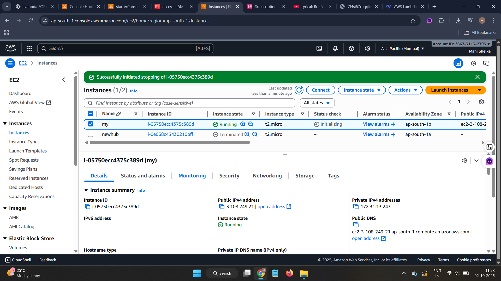
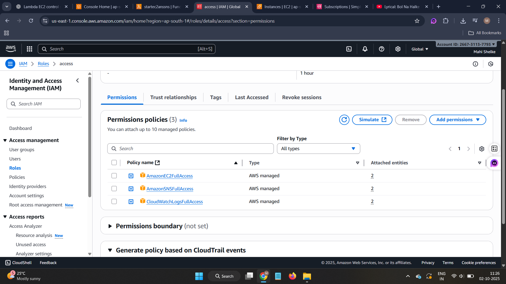
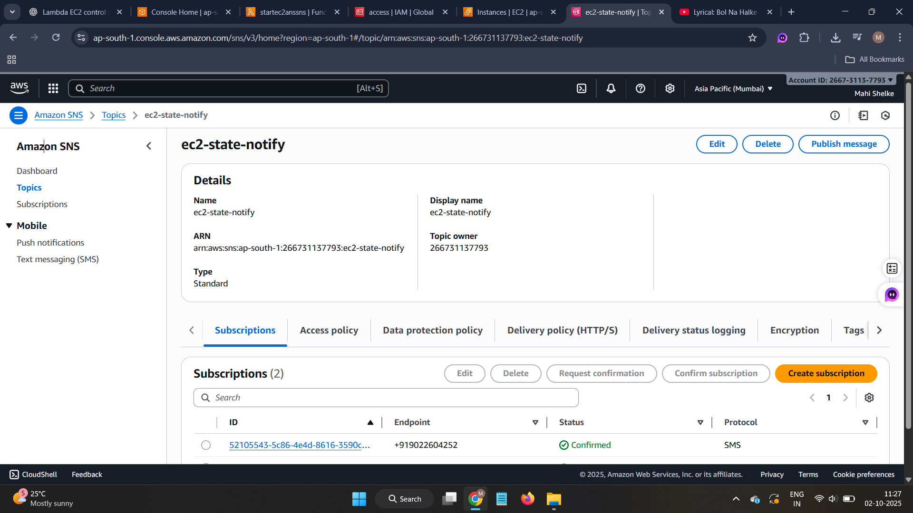
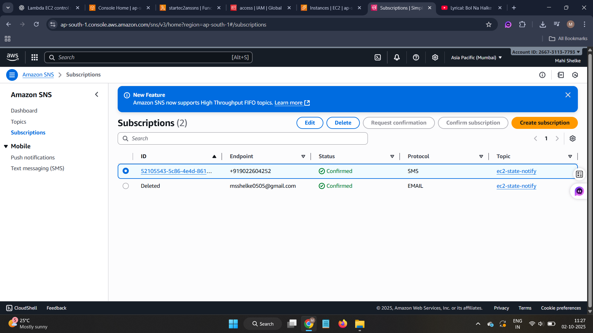
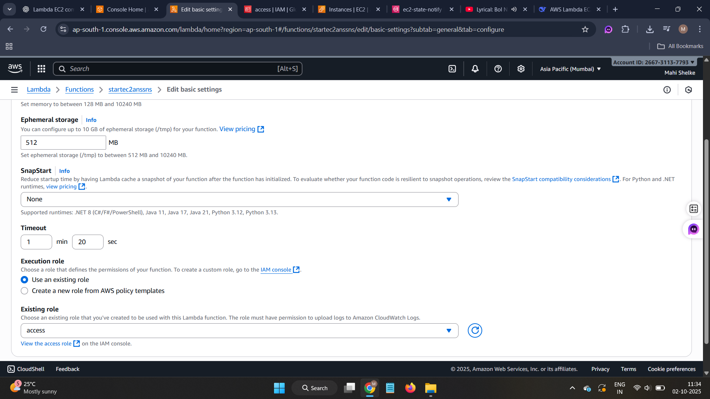
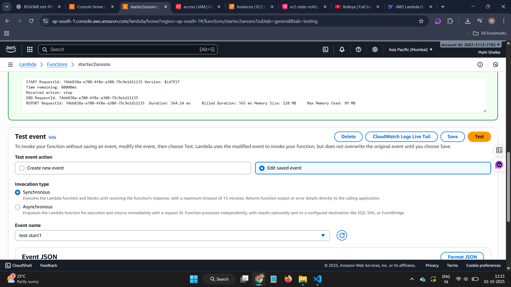
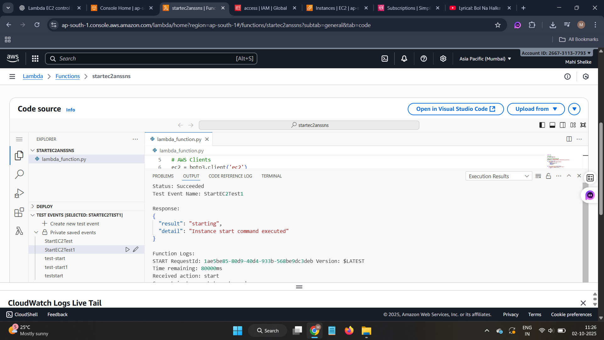
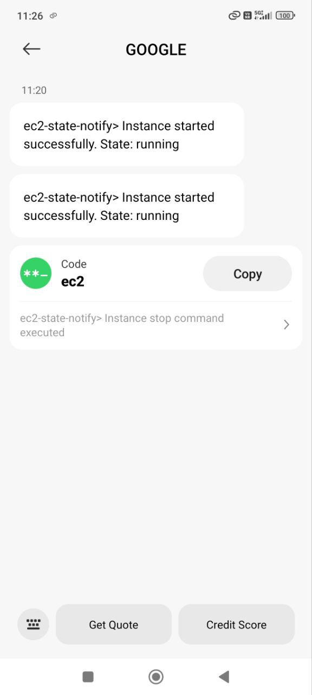
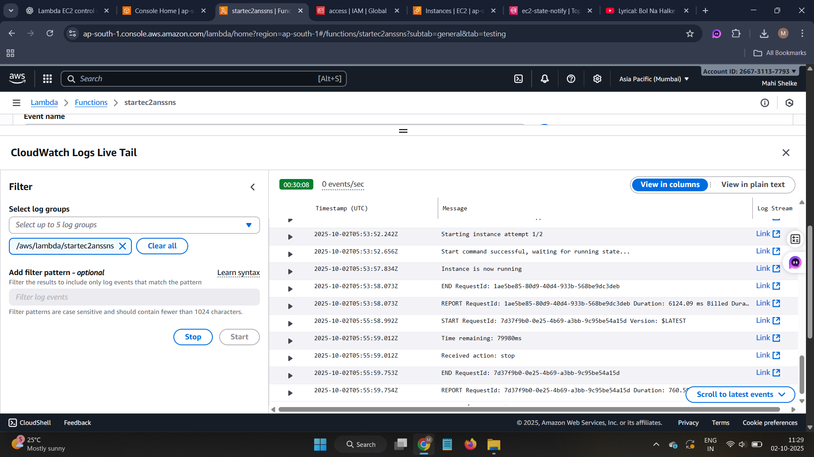

## 📖 Introduction

**AWS EC2 Instance Manager** is a **serverless solution** designed to simplify cloud infrastructure management. This project addresses the common challenge of efficiently controlling **EC2 instances** while maintaining **real-time visibility** into their status.

In today's cloud-centric environment, managing compute resources efficiently is crucial for both **cost optimization** and **operational excellence**. Traditional methods of managing EC2 instances via the AWS Console can be **time-consuming** and lack **immediate feedback**.  

Our solution bridges this gap by providing:

- ✅ **Start, Stop, and Monitor EC2 Instances** in a few clicks
- ✅ **Real-time notifications** via AWS SNS (SMS & Email)
- ✅ **Serverless architecture** using AWS Lambda
- ✅ **Python-powered automation** for scalability and efficiency
- ✅ **Cost-effective**: Only pay for what you use

---


## ⚙️ Features

| Feature | Description |
|---------|-------------|
| **Instance Management** | Start, stop, and reboot EC2 instances directly from Lambda. |
| **Real-Time Notifications** | Receive SMS or Email alerts when instance state changes. |
| **Serverless Design** | No need for dedicated servers; fully managed by AWS Lambda. |
| **Dashboard Ready** | Easily integrate with dashboards or CLI scripts. |
| **Cost Optimization** | Helps reduce unused instance charges with automated controls. |

---

## 🛠️ Technologies Used

- **AWS Lambda** – Serverless compute to manage instances  
- **AWS EC2** – Elastic Compute Cloud instances  
- **AWS SNS** – Notifications via SMS & Email  
- **Python 3.9** – Core scripting language  

---

## 🏗️ Setup Instructions

### Prerequisites
- AWS Account
- EC2 Instance
- Basic knowledge of AWS services
---
## 🖥️ EC2 Instance Setup

Follow these steps to launch and configure your EC2 instance for Lambda management:

---

### 1️⃣ Launch EC2 Instance

- Go to **EC2** in AWS Console → Click **Launch instances**

---

### 2️⃣ Basic Configuration

- **Name:** `my-ec2-instance`  
- **AMI:** Amazon Linux (Free tier)  
- **Instance type:** `t2.micro` (Free tier)  
- **Key pair:** Create new or select existing

---

### 3️⃣ Network & Security

- **VPC:** Default  
- **Subnet:** Any availability zone  
- **Auto-assign public IP:** Enabled  
- **Security group:** Create new `ec2-lambda-access`  
  - **Inbound rules:**  
    - SSH (22) → Your IP  
    - HTTP (80) → Anywhere (optional)  
    - HTTPS (443) → Anywhere (optional)

---

### 4️⃣ Storage

- **Root volume:** 8 GB GP2

---

### 5️⃣ Launch Instance

- Click **Launch**  
- Download key pair if creating a new one  

---

### 6️⃣ Get Instance ID

- Go to **Instances** list → Select your instance → Copy **Instance ID** (e.g., `i-1234567890abcdef0`)  
- Use this ID in your **Lambda code** for automation
---

---
## 🔐 IAM Role Setup

Follow these steps to create an IAM role for your Lambda function:

---

### 1️⃣ Go to IAM

- Open **IAM** in AWS Console → Click **Roles** → Click **Create role**

---

### 2️⃣ Trusted Entity

- **Use case:** Select **AWS service** → **Lambda** → Click **Next**

---

### 3️⃣ Attach Permissions

Add the following policies:

- `AmazonEC2FullAccess` (or `AmazonEC2ReadOnlyAccess` + specific permissions)  
- `AmazonSNSFullAccess` (or `AmazonSNSReadOnlyAccess` + `sns:Publish`)  
- `CloudWatchLogsFullAccess` (for logging)

---

---
### 4️⃣ Role Details

- **Role Name:** `lambda-ec2-sns-role`  
- **Description:** Role for Lambda to manage EC2 & send SNS notifications  
- Click **Create role**

---
### Step 1: Create SNS Topic
1. Go to **SNS Console**
2. Click **Create Topic**
3. Choose **Standard** type
4. Name: `ec2-state-notify`
5. Click **Create Topic**



### Step 2: Subscribe to Notifications
1. Open your SNS topic
2. Click **Create Subscription**
3. Protocol: **SMS** or **Email**
4. Endpoint: Your phone number (+91XXXXXXXXXX) or email
5. Click **Create Subscription**



### Step 3: Create Lambda Function
1. Go to **Lambda Console**
2. Click **Create Function**
3. Choose **Author from scratch**
4. Basic Information:
   - Function name: `startec2mssns`
   - Runtime: **Python 3.9**
5. Click **Create Function**


### Step 4: Configure Lambda Permissions
Add these permissions to your Lambda execution role:
```json
{
    "Version": "2012-10-17",
    "Statement": [
        {
            "Effect": "Allow",
            "Action": [
                "ec2:StartInstances",
                "ec2:StopInstances", 
                "ec2:DescribeInstances"
            ],
            "Resource": "*"
        },
        {
            "Effect": "Allow",
            "Action": "sns:Publish",
            "Resource": "arn:aws:sns:ap-south-1:YOUR_ACCOUNT_ID:ec2-state-notify"
        }
    ]
}
```
---


## 🚀 Deploy Lambda Code

Follow these steps to deploy your AWS Lambda function to manage EC2 instances with real-time notifications.

---

### 1️⃣ Lambda Function Code

Copy the following **Python code** to your Lambda function:

```python
import json
import boto3
import time

# AWS Clients
ec2 = boto3.client('ec2')
sns = boto3.client('sns')

# Configuration
INSTANCE_ID = "i-0e068c43430210bff"
SNS_TOPIC_ARN = "arn:aws:sns:ap-south-1:your account id:ec2-state-notify"

def publish_sms(message):
    """Send SMS notification"""
    try:
        response = sns.publish(
            TopicArn=SNS_TOPIC_ARN,
            Message=message,
            MessageAttributes={
                'AWS.SNS.SMS.SMSType': {
                    'DataType': 'String',
                    'StringValue': 'Transactional'
                }
            }
        )
        print(f"SMS sent: {response['MessageId']}")
        return True
    except Exception as e:
        print(f"SMS error: {str(e)}")
        return False

def lambda_handler(event, context):
    """Main Lambda handler"""
    
    # Extract action from event
    action = ""
    if isinstance(event, dict):
        action = event.get('action') or (event.get('queryStringParameters') or {}).get('action','')
        if not action and event.get('body'):
            try:
                action = json.loads(event['body']).get('action','')
            except:
                pass

    action = (action or "").lower()
    print(f"Action received: {action}")

    try:
        if action == 'test':
            success = publish_sms(f"TEST: EC2 Monitor - Instance {INSTANCE_ID}")
            return {'result': 'test', 'sms_sent': success}

        if action == 'start':
            status_resp = ec2.describe_instances(InstanceIds=[INSTANCE_ID])
            current_state = status_resp['Reservations'][0]['Instances'][0]['State']['Name']
            if current_state == 'running':
                publish_sms(f"🟢 EC2 - ALREADY RUNNING")
                return {'result': 'already_running'}
            
            publish_sms(f"🟡 EC2 - STARTING...")
            ec2.start_instances(InstanceIds=[INSTANCE_ID])
            waiter = ec2.get_waiter('instance_running')
            waiter.wait(InstanceIds=[INSTANCE_ID], WaiterConfig={'Delay': 10, 'MaxAttempts': 12})
            publish_sms(f"✅ EC2 - STARTED SUCCESS")
            return {'result': 'started'}

        if action == 'stop':
            publish_sms(f"🟡 EC2 - STOPPING...")
            ec2.stop_instances(InstanceIds=[INSTANCE_ID])
            waiter = ec2.get_waiter('instance_stopped')
            waiter.wait(InstanceIds=[INSTANCE_ID], WaiterConfig={'Delay': 10, 'MaxAttempts': 12})
            publish_sms(f"🛑 EC2 - STOPPED SUCCESS")
            return {'result': 'stopped'}

        resp = ec2.describe_instances(InstanceIds=[INSTANCE_ID])
        state = resp['Reservations'][0]['Instances'][0]['State']['Name']
        state_icon = '🟢' if state == 'running' else '🛑'
        publish_sms(f"{state_icon} EC2 - {state.upper()}")
        return {'result': 'status', 'state': state}
        
    except Exception as e:
        error_msg = f"❌ EC2 ERROR: {str(e)}"
        publish_sms(error_msg)
        return {'result': 'error', 'error': error_msg}
```
---
## 2️⃣ Lambda Function Settings

- **Timeout:** 1.20 minutes  
- **Memory:** 128 MB  
- **Environment Variables (Optional):**  
  - `INSTANCE_ID = i-0e068c43430210bff`  
  - `SNS_TOPIC_ARN = arn:aws:sns:ap-south-1:266731137793:ec2-state-notify`  



---

## 3️⃣ Test the Function

1. Go to the **Test** tab in the Lambda console.  
2. Create a **new test event** with the following JSON:

```json
{
  "action": "start"
}

{
  "action": "stop"
}

```


### Test Results

### Lambda Console


### SNS Topic Configuration


### Test Results


### SNS Topic Notifications


### CloudWatch Logs

